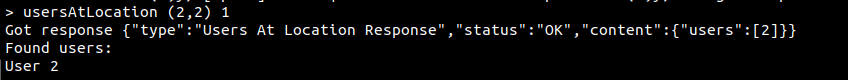

# Contact Tracing (February - May 2021)

This project consisted of creating a byzantine tolerant and secure contact tracing system (using the real world context of the COVID-19 pandemic). More information about features of this project can be found in the project statements and reports, [here](doc).

## How to run the project

### Before

Run sample script to generate entity keys

```bash
./sample.sh
```

We provide a sample grid for the client to use (under `client/grid/grid_config.txt`).

You can use this one or modify it.

You can modify the maximum number of byzantine users in the system. Navigate to `HelperConstants.java` in the `lib` module and change the parameter `MAX_BYZANTINE_USERS`. You can also change the number of replicas in the system (parameter `NUM_SERVERS`) as well as the maximum number of byzantine replicas (parameter `MAX_BYZANTINE_SERVERS`)

In a terminal, at the source of the project, run `mvn install -DskipTests` to install all the dependencies needed and compile the project.

### Database

Each server will create (or read if already exists) its own `data_server<id>.db` file when it runs, to load already stored records. If you want to restart the system from the beginning, please delete the relevant files beforehand.

### Server

To run a new server, lauch a new terminal window, navigate to the `server/` directory and run `mvn exec:java -Dexec.args="[id]"`. Change `[id]` to the id of the server you want to create, and it must be unique.


**NOTE:** If you use the provided `sample.sh` to generate the keys, you can instantiate at most 4 replicas with ids `1`, `2`, `3` and `4`.

### Clients

To run a new normal client, lauch a new terminal window, navigate to the `client/` directory and run `mvn exec:java -Dexec.args="[id] grid/grid_config.txt"`. Change `[id]` to the id of the client you want to create, and it must be unique. You can change the file with the grid to any file you want, as long as it follows the same structure.


When the client is lauched, you will se a `>` prompt. This can be used to query the server for the `obtainLocationReport` command as well as the `requestMyProofs` command. Type `help` to see a list of commands. The proof and witnessing services will be running automatically.


**NOTE:** If you use the provided sample grid (`client/grid/grid_config.txt`) you need to instantiante 4 different clients in 4 different terminals with ids `1`, `2`, `3` and `4`.

### HA Client

The Health Authority (HA) client runs very similar to a normal client. Navigate to the `ha_client/` directory and run `mvn exec:java`


When the HA client is lauched, you will see a `>` prompt. This can be used to query the server with the `obtainLocationReport` and `obtainUsersAtLocation` commands. Type `help` to see a list of comands and how to use them.




### Running Tests and Scripts

To run the tests and verify if the system is properly working, run `mvn test` and the root directory. Alternatively, you can go to the `client/` or `server/` or `lib/` directories and run `mvn test` to test the client, server and lib, respectively.
