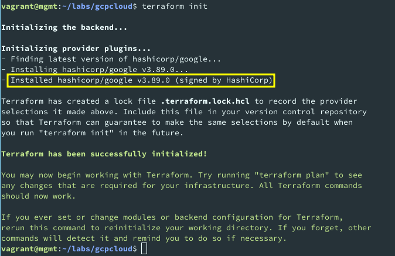
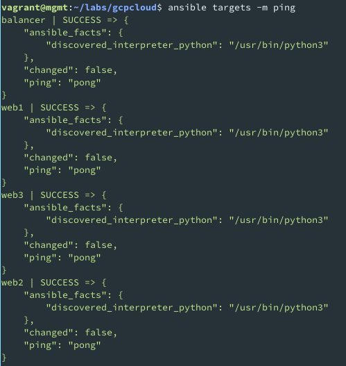
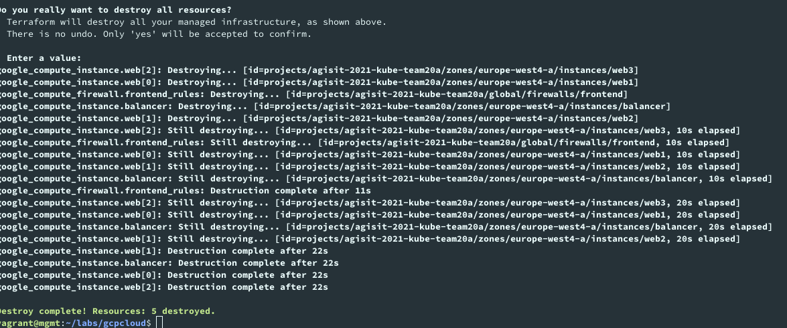
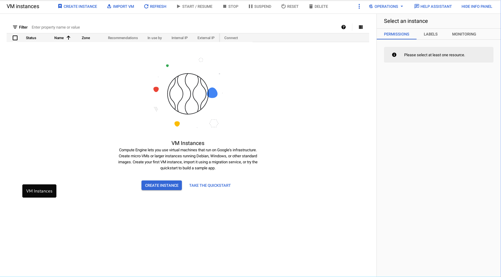

# Webfront Lab README

AGISIT 20201-2022

## Authors

[//]: # (fill the following line with the Group Identifier, for example 03A or 12T, and then delete THIS line)
**Team 20A**

[//]: # (use photos of team members 150px height, square; and then delete THIS line)

    
    
    

[//]: # (fill the following table with identifiers of each team member; and then delete THIS line)

| Number | Name              | Username                                     | Email                               |
| -------|-------------------|----------------------------------------------| ------------------------------------|
| ist189399 | Afonso Goncalves | <https://git.rnl.tecnico.ulisboa.pt/ist189399> | <mailto:afonso.corte-real.goncalves@tecnico.ulisboa.pt> |
| ist190621 | Maria Filipe | <https://git.rnl.tecnico.ulisboa.pt/ist190621> | <mailto:maria.j.d.c.filipe@tecnico.ulisboa.pt> |
| ist189498 | Maria Martins | <https://git.rnl.tecnico.ulisboa.pt/ist189498> | <mailto:maria.d.martins@tecnico.ulisboa.pt> |

## Q01
 > When you run the command `terraform init` which plugins were installed? (You can copy the result of the command to insert in your report).

    

## Q02
 > Analyze briefly the `terraform-gcp-servers.tf` and interpret its purpose.

| Line no | Interpretation |
| ------- | -------------- |
| 10      | Creates 3 instances |
| 11, 38  | Sets name for each inscance |
| 12, 39  | Sets machine type as `n1-standard-1` (according to variable) |
| 13, 40  | Sets region to `europe-west4` (according to variable) |
| 15-21, 42-48   | Sets `ubuntu-2004-focal-v20210927 (according to variable) as boot image |
| 23-27, 50-54   | Attaches network interfact to default network |
| 25-26, 52-53   | Assigns an external IP to the machine |
| 29-31, 56-58   | Attaches mgmt public key to VM instance (allows passwordless ssh) |
| 32, 60  | Adds network tag to machine |

## Q03
 > Analyze briefly the `terraform-gcp-variables.tf` and interpret its purpose.

This file declares configuration variables that will be used in other terraform files. This way, if something needs to be changed, it is only changed once!

| Line no | Interpretation |
| ------- | -------------- |
| 6-8 | Sets a variable for the project name |
| 15-17 | Sets a variable for the machine type |
| 23-25 | Sets a variable for the region the vms will run |
| 28-30 | Sets a variable for the disk size |

## Q04
 > If you would need more Web servers where and how would you declare that intention (with Terraform)?

We could change the `count` property in file `terraform-gcp-servers.tf:10` to the desired number of web servers.

## Q05
 > Which other files appeared in the `gcpcloud` folder after running `terraform apply` for your infrastructure?

After running `terraform apply`, we could see that terraform created the files `terraform.tfstate` and `terraform.tfstate.backup`. The first file contains the state information of the remote cloud infratstructure terraform just created (can be updated with `terraform refresh`). The latest file is a backup in case the former is somehow lost or currupted.

## Q06
 > After creating the infrastructure with Terraform, you needed to modify the `gcphosts` inventory. What was changed in that file, and what was the purpose?

We used the output of the `terraform apply` command to gather the IPs of the created machines. We then added those IPs to the ansible inventory (in each line, we set the IP corresponding to the hostname), so that ansible knew where to connect when running the plays.

## Q07
 > After creating the infrastructure with Terraform, you have tested the communication with the remote instances using an Ansible ad-hoc command. Copy the result into your report. Was the result successful? In case of positive answer, can you explain why it worked, i.e., how was Ansible capable of establishing a session with the remote instances?

The connectivity was successful:

    

The `ssh` connection succeeded since every VM already contained the `mgmt` public key in their `~/.ssh/authorized_hosts` file. This key was installed when the machines were created. This occured since lines `31` and `44` of `terraform-vmcloud-servers.tf` attach this same public key to these machines.

## Q08
 > Which files did you had to modify, so that Ansible could Configure correctly the instances? Explain in detail what were the modifications.

Ansible couldn't generate `haproxy.cfg` nor `index.html` from templates since in the playbook, the `src` value contained an invalid path. After fixing this error, ansible run correctly with no trouble.

## Q09
 > When the system was fully deployed, when hitting the refresh button on the web browser with the address of the Load Balancer, What changed? Describe those changes and interpret why they happened (if indeed happened). Which IP addresses of the instances were Shown, and what do they correspond to?

At each refresh, the presented page would change according to the web server that was serving it. This happened since the balancer was alternating the servers in a roundrobin mode, as configured in the `haproxy.cfg.j2:54` template.

## Q10
 > When you run `terraform destroy` what was the result after you have confirmed the question "Do you really want to destroy all resources?". Copy those results to your report. After the destroy, looking at the Google Cloud Platform Dashboard, namely in the ACTIVITY tab, what information is displayed so that you are sure the resources have really been destroyed?

After running `terraform destroy` command, we could see the following output:

    

Meaning that the virtual machines were successfully destroyed. When checking the GCP Dashboard, we could confirm that the operation was successful:

    

