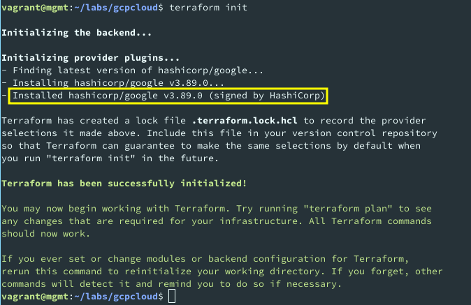
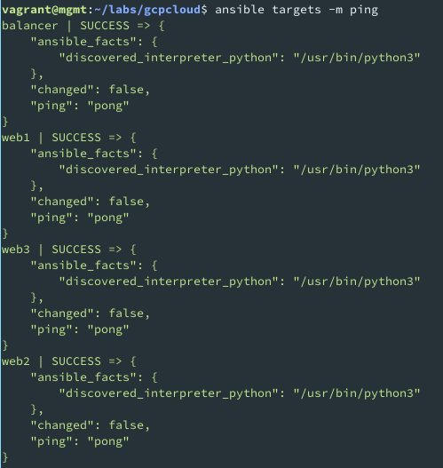
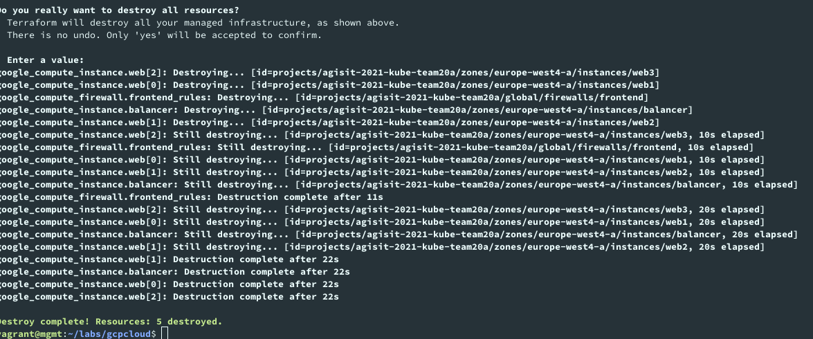
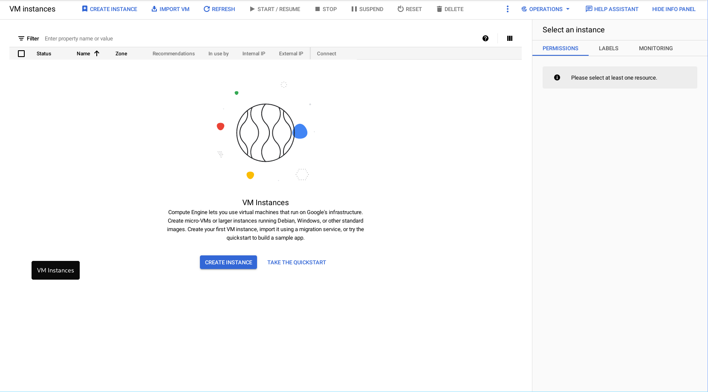

# LAB03 README

AGISIT 20201-2022

## Authors

[//]: # (fill the following line with the Group Identifier, for example 03A or 12T, and then delete THIS line)
**Team 20A**

[//]: # (use photos of team members 150px height, square; and then delete THIS line)

    
    
    

[//]: # (fill the following table with identifiers of each team member; and then delete THIS line)

| Number | Name              | Username                                     | Email                               |
| -------|-------------------|----------------------------------------------| ------------------------------------|
| ist189399 | Afonso Goncalves | <https://git.rnl.tecnico.ulisboa.pt/ist189399> | <mailto:afonso.corte-real.goncalves@tecnico.ulisboa.pt> |
| ist190621 | Maria Filipe | <https://git.rnl.tecnico.ulisboa.pt/ist190621> | <mailto:maria.j.d.c.filipe@tecnico.ulisboa.pt> |
| ist189498 | Maria Martins | <https://git.rnl.tecnico.ulisboa.pt/ist189498> | <mailto:maria.d.martins@tecnico.ulisboa.pt> |

## Q01
The plugin installed was hashicorp/google as we can confirm below:

    

## Q02
The purpose of this file is to create 3 instances and to configure them.
The name, the type, the region and the boot image for all the instances is set in the file. Besides that, an external IP is assigned to the machine, a network interface is attached to the default network, the mgmt publick key to the VM instance and a network tag to each machine.

## Q03
The purpose of this file is to declare the configuration variables so other terraform files know what we are talking about when we use those same variables.
The variables set are the following: project name, machine type, region and disk size.

## Q04
We would declare that intention by changing the count property in the file terraform-gcp-servers.tf(line 10).

## Q05
After running terraform apply we were able to see two new files: terraform.tfstate and terraform.tfstate.backup.

## Q06
The changes made to the gcphosts inventory file were the addition of the IPs of the machines created and their correspondence to the hostname in order for ansible to know the IPs of the hosts when running the plays.

## Q07
The connection was sucessful as we can see below:

    

This happened because the mgmt public key was already inside the ~/.ssh/authorized_hosts file in each of the VMs since it was intalled when each VM was created (lines 31 and 44 of the terraform-vmcloud-servers.tf attach that same public key to the machines).

## Q08
The file that needed changes was the ansible-gcp-servers-setup-all.yml playbook since the path in it was invalid. The modifications made were:
src: /home/vagrant/gcpcloud-tenant/templates/index.html.j2 -> src: /home/vagrant/labs/gcpcloud/templates/index.html.j2 (line 59)
src: /home/vagrant/gcpcloud-tenant/templates/haproxy.cfg.j2 -> src: /home/vagrant/labs/gcpcloud/templates/haproxy.cfg.j (line 116)

## Q09
Yes. The name of the server and the IP of the server that show up in the center of the page change everytime we refresh the page, just like it should since the load balancer is alternating them using the roundrobin mode.
The IPs shown are the ones that correspond to the web servers.

## Q10
Looking at the results below we can conclude that there are no resources left and everything as been destroyed:

The output of terraform destroy:

    

The VMCloud Dashboard:

    

