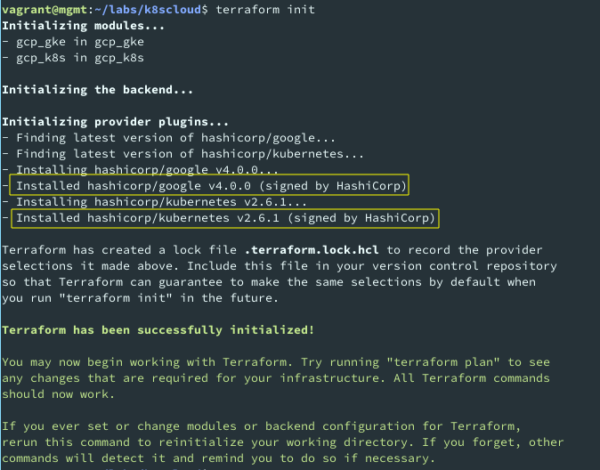
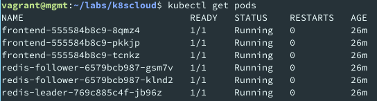
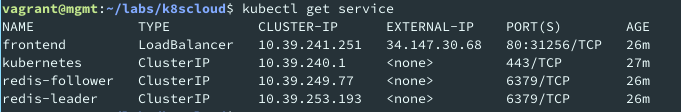
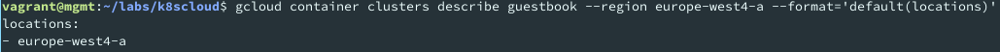

# LAB04 README

AGISIT 2021-2022

## Authors

[//]: # (fill the following line with the Group Identifier, for example 03A or 12T, and then delete THIS line)
**Team 20A**

[//]: # (use photos of team members 150px height, square; and then delete THIS line)

    
    
    

[//]: # (fill the following table with identifiers of each team member; and then delete THIS line)

| Number | Name              | Username                                     | Email                               |
| -------|-------------------|----------------------------------------------| ------------------------------------|
| ist189399 | Afonso Goncalves | <https://git.rnl.tecnico.ulisboa.pt/ist189399> | <mailto:afonso.corte-real.goncalves@tecnico.ulisboa.pt> |
| ist190621 | Maria Filipe | <https://git.rnl.tecnico.ulisboa.pt/ist190621> | <mailto:maria.j.d.c.filipe@tecnico.ulisboa.pt> |
| ist189498 | Maria Martins | <https://git.rnl.tecnico.ulisboa.pt/ist189498> | <mailto:maria.d.martins@tecnico.ulisboa.pt> |

## Q01
 > When you run the command `terraform init` which plugins were installed? (You can copy the result of the command to insert in your report).

Terraform installed the hashicorp kubernetes and google plugins, as we can confirm below:

    

## Q02
 > Analyze briefly the `terraform.tfvars` and interpret its purpose.

This file defines variables that help configuring the project and that will be used in other terraform files. These variables are 1) the project ID, 2) the number of worker nodes in the cluster and 3) the region where the cluster will be located

## Q03
 > Analyze briefly the `gcp-gke-main.tf` and interpret its purpose.

This file orchestrates the creation of the cluster and the creation of the pods and services. It first creates the GKE cluster, using the `gcp_gke` module. It then uses the `gcp_k8s` module with the outputted cluster certificates to launch the pods and services.

| Line no   | Interpretation |
|-----------|----------------|
| 4 - 14    | Declares the variables that will be used in this file |
| 19 - 21   | Sets a data resource to access the configuration of the Google Cloud provider |
| 20        | Makes sure this resource is created only after the `gcp_gke` module |
| 29 - 34   | Invokes the `gcp_gke` module (located in `./gcp_gke`), passing `project`, `region` and `workers_count` variables as parameters |
| 37 - 44   | Invokes the `gcp_k8s` module (located in `./gcp_k8s`), passing the outputs of the `gcp_gke` module as parameters |

## Q04
 > If you would need a larger Cluster (more Replicas) where and how would you declare that intention

We would declare that intention by changing the `workers_count` property in the `terraform.tfvars` file.

## Q05
 > When provisioning the infrastructure with Terraform, were there Errors related with Quota limits? If affirmative, what were the errors and did you solve them (or not...)?

There were no errors when provisioning the infrastructure with Terraform, since we deployed the whole infrastructure within a zone. We then tried to apply the same project within a broader region and we got the expected Quota Limit Exceeded error. To solve that problem, we could ask Google to increase the Quota limits.

## Q06
 > In case of success, which other files appeared in the `k8scloud` folder after running terraform apply for your infrastructure?.

After running `terraform apply`, we could see that terraform created the files `terraform.tfstate` and `terraform.tfstate.backup`. The first file contains the state information of the remote cloud infratstructure terraform just created (can be updated with `terraform refresh`). The latest file is a backup in case the former is somehow lost or currupted.

## Q07
 > In the `gcp-gke-main.tf` and in the `k8s-provider.tf` files, the module declarations or Provider declaration, require the specification of some variables, such as those related with RBAC (Role Base Access Control). Can you figure out and explain (briefly) how the "values" of those variables were obtained?

In the `gcp-gke-main.tf` file, these values were obtained by using the outputs of the `gcp_gke` module. These values were then passed as parameters to the `gcp_k8s` module, where they were finally used.

## Q08
 > In the `k8s-pods.tf` file, the declarations start with the Backend Pods, followed by the Frontend Pods. Do you think there is a reason for that order, or is it indifferent? 

There is a reason for the order. The frontend needs to connect to the backend so it is required that the backend pods already exists when the frontend pods are created.

## Q09
 > When the system was fully deployed, which IP addresses of the Cluster nodes were reported?

The IPs of the clusters were the following:

* frontend - 10.3.250.44
* kubernetes - 10.3.240.1
* redis-follower - 10.3.255.173
* redis-leader - 10.3.245.244

## Q10
 > When you run `kubectl get pods` and `kubectl get services` what information was returned?  Also, interpret what was returned with the command:

When running `kubectl get pods` we obtained the following:

    

This shows a list of pods that are running presenting, for each, how many of the replicas are ready to serve, the status of the pod, how many restarts and for how long it is running.

When running `kubectl get services` we obtained:

    

This shows a list of services presenting, for each, their type, their VPC IP, the external IP of the entrypoint, the port mappings and finally, for how long those services are running

Finally, we run `gcloud container clusters describe guestbook --region <Region> --format='default(locations)'`. This command describes the existing cluster for the running containers. By using the `--format` for the locations we are only fetching the information about the locations of the cluster. We can see the result below:

    

