# LAB04 README

AGISIT 2021-2022

## Authors

[//]: # (fill the following line with the Group Identifier, for example 03A or 12T, and then delete THIS line)
**Team 20A**

[//]: # (use photos of team members 150px height, square; and then delete THIS line)
<p align=center>
    
    
    
</p>


[//]: # (fill the following table with identifiers of each team member; and then delete THIS line)

| Number | Name              | Username                                     | Email                               |
| -------|-------------------|----------------------------------------------| ------------------------------------|
| ist189399 | Afonso Goncalves | <https://git.rnl.tecnico.ulisboa.pt/ist189399> | <mailto:afonso.corte-real.goncalves@tecnico.ulisboa.pt> |
| ist190621 | Maria Filipe | <https://git.rnl.tecnico.ulisboa.pt/ist190621> | <mailto:maria.j.d.c.filipe@tecnico.ulisboa.pt> |
| ist189498 | Maria Martins | <https://git.rnl.tecnico.ulisboa.pt/ist189498> | <mailto:maria.d.martins@tecnico.ulisboa.pt> |

## Q01
 > When you run the command `terraform init` which plugins were installed? (You can copy the result of the command to insert in your report).

As we can see, terraform installed 4 providers: `google`, `kubernetes`, `helm` and `kubectl`

<p align=center>
    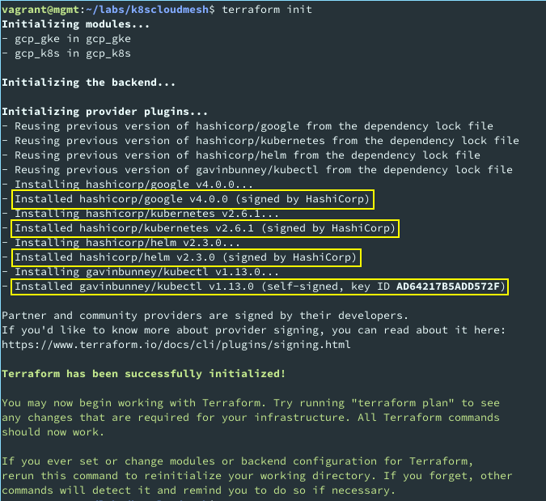
</p>


## Q02
 > Analyze briefly the `k8s-monitoring.tf` and interpret its purpose.

This file creates kubernetes resources for Prometheus and Grafana, according to the files present in the `gcp_k8s/monitoring` directory

| Line no. | Interpretation|
|----------|---------------|
| 5-7, 19-21 | Creates a data resource (one for Grafana, the other for Prometheus) that consists of a set of YAML manifests. These manifests were loaded from the path given in the `content` attribute and will be used to create the manifest resource in this same file |
| 9-16, 23-30 | Configures a remote kubernetes resource for each manifest previously created |


## Q03
 > Analyze briefly the `k8s-istio.tf` and interpret its purpose.

This file declares the `ISTIO` resources that will implement the Service Mesh infrastructure

| Line no. | Interpretation|
|----------|---------------|
| 5-16 | Deploys the `ISTIO` Service Mesh, by using the pre-installed `ISTIO` charts |
| 18-28 | Deploys the `ISTIO` Discovery Service by using the pre-installed `ISTIO` charts |


## Q04
 > In Module `gcp_k8s` there is a folder named monitoring containing two `.yaml` files. What is the purpose of those files?

These files configure Prometheus and Grafana Pods in the Kubernetes cluster and are loaded in `gcp_k8s/k8s-monitoring.tf` file.

The file `prometheus.yaml` also configures Prometheus Service, Pod and deployment and also its Role Based Access Control (RBAC).

The file `grafana.yaml` configures the Grafana Service and Pod, and also its data sources, the dashboard providers, and the dashboards it will present to the user.
We can see huge JSON objects in this configuration file. After parsing them (see image below), we understood that each object configures a dashboard (we can note the `title` property) and has a set of `panels`, each corresponding to a respective metrics visualization.

<p align=center>
    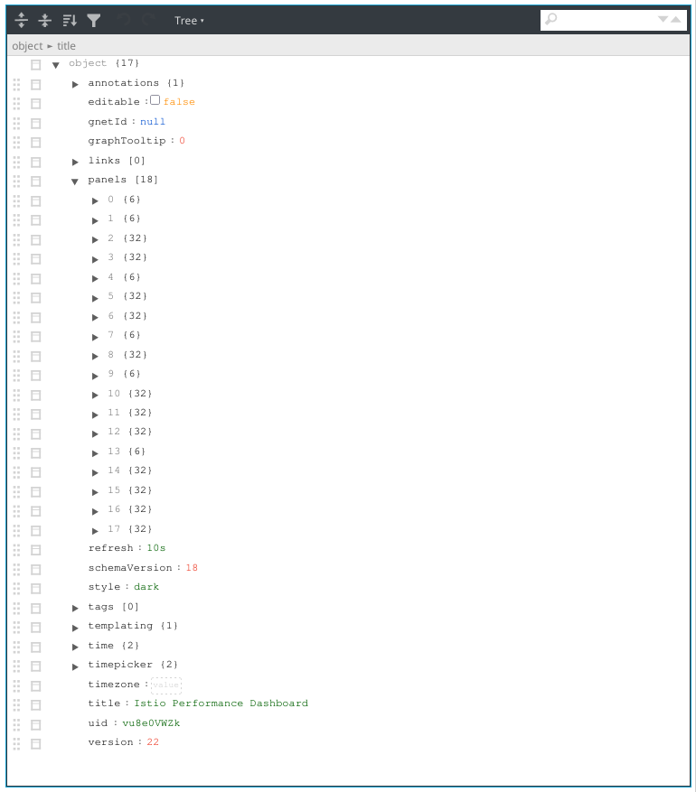
</p>


## Q05
 > Use the command `kubectl get pods` to get the information about the application Pods and report the result. How many containers were reported in each Pod?

After running the command `kubectl get pods -n application`, we got the following output:

<p align=center>
    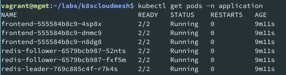
</p>

This shows that there are 2 containers running in each Pod. This is due to the Service Mesh architecture: One container is the service instance and handles the application logic. The other one is the proxy instance (a.k.a. sidecar), which handles interservice communication and "abstracts away security and connection concerns from the development of the application" ([src](https://www.nginx.com/blog/what-is-a-service-mesh/)).


## Q06
 > Check all the information in the istio-system and report the result. Which Pods in state running were reported. Are there replica sets reported?

After running the command `kubectl get all -n istio-system`, we got the following output:
<p align=center>
    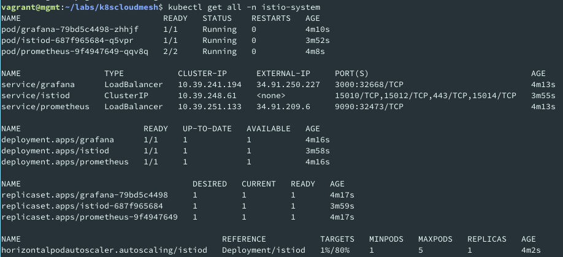
</p>

We can see that in the `istio-system` namespace, there are three Pods running: one for `Prometheus`, another for `Grafana` and a last one for `istiod` (`ISTIO` discovery service) and each Pod has a service assigned to it. The command reported three `replicasets`, one for each Pod. Each contains one replica running, as desired.


## Q07
 > Get the information about all the services running in the Kubernetes cluster, and write it in the report.

After running the command `kubectl get services --all-namespaces`, we were able to get information about all the running Services of this cluster, as shown below:

<p align=center>
    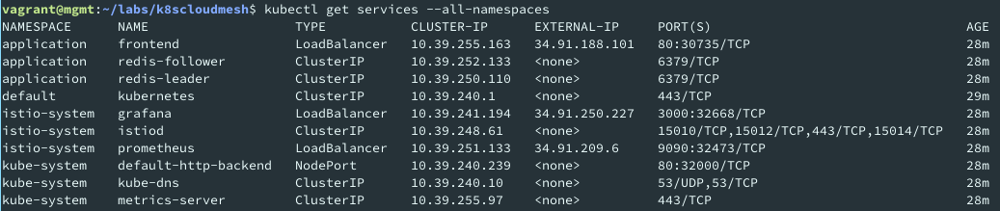
</p>

We can see several services in this output, belonging to one of three user-defined namespaces (`application`, `istio-system` and `kube-system`). We can see that only services directly accessible from the outside of the cluster are `grafana`, `prometheus` and `frontend`, each having its own external IP. We can note that despite some services correspond to replicated Pods (e.g. `redis-follower`), each service is listed only once, indicating that the same service is used by every associated replica. This demonstrates the transparency of replication in Kubernetes.

## Q08
 > Which metrics (and targets) have you selected to observe in Prometheus? Post a screenshot of the Prometheus Dashboard showing the values of some of the metrics for kubernetes-pods.

Prometheus allows a user to select any of the available metrics and displays a graph with the targeted data from the selected labels. Below we can see the `container_memory_cache` metric from `php-redis` containers. This graph shows a flat line since the memory cache usage was constant for the entire process.

<p align=center>
    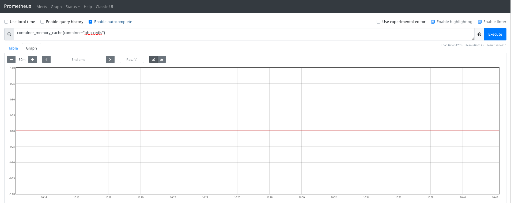
</p>


## Q09
 > Select a Grafana Performance Dashboard. Which Metrics compose the Dashboard? Post a screenshot of that Dashboard in your report.

The charts on this dashboard show Istio main components cost in terms of resource utilization under steady load, namely the vCPU usage, Memory footprint of the components, the amount of bytes flowing through each component and the number of Goroutines.

Below we can see some of these graphs:

<p align=center>
    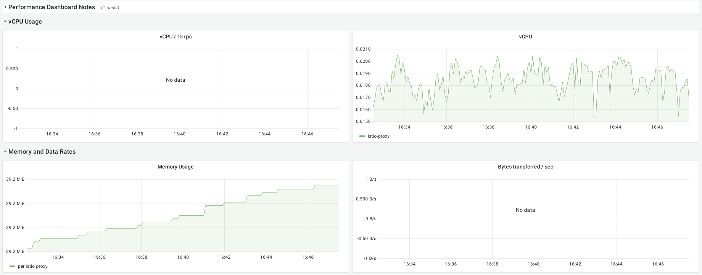
    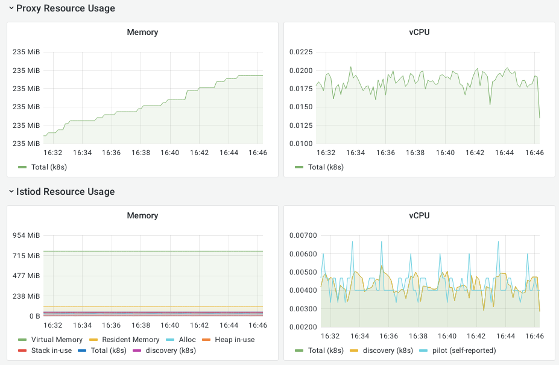
</p>

## Q10
 > Select a Grafana Service Dashboard. Which Metrics compose the Dashboard? Post a screenshot of that Dashboard in your report.

The charts on this dashboard show metrics on the running services, such as the number of requests, the percentage of successful requests, the client and server request durations, the number of sent and received bytes, request duration and size, response size and duration

Below we can see some of these graphs:

<p align=center>
    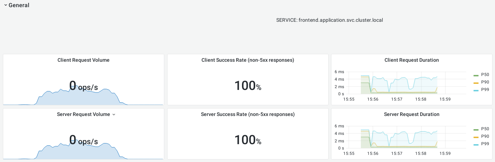
    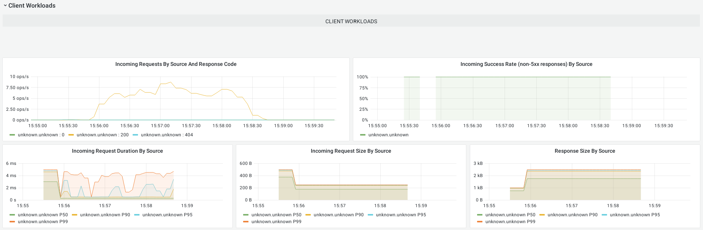
    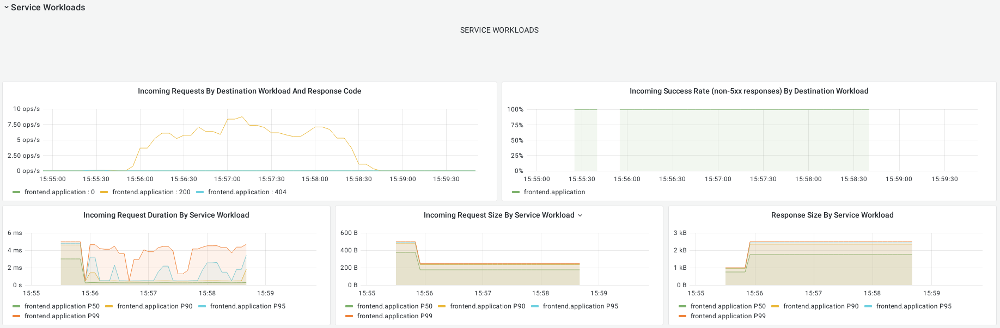
</p>


---

```
 -----------
< TEAM 20 A >
 -----------
        \   ^__^
         \  (oo)\______
            (__)\       )\/
                ||----w 
                ||     |
```
