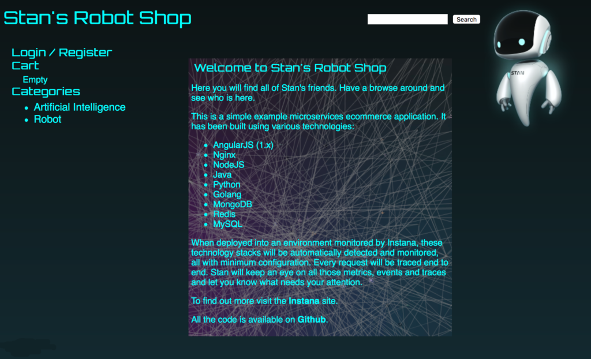
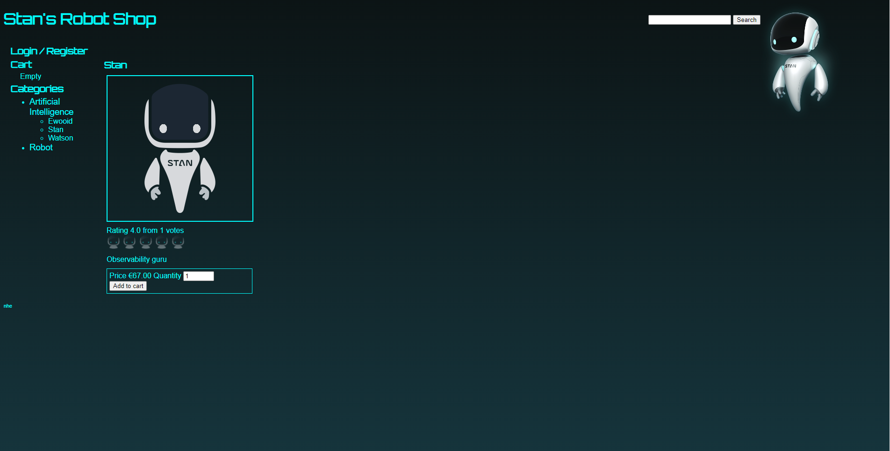
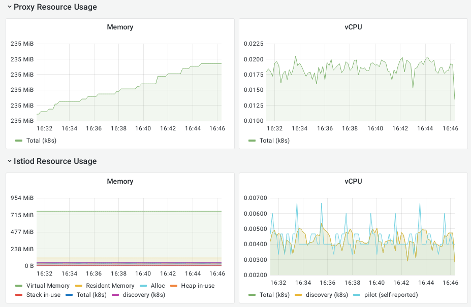
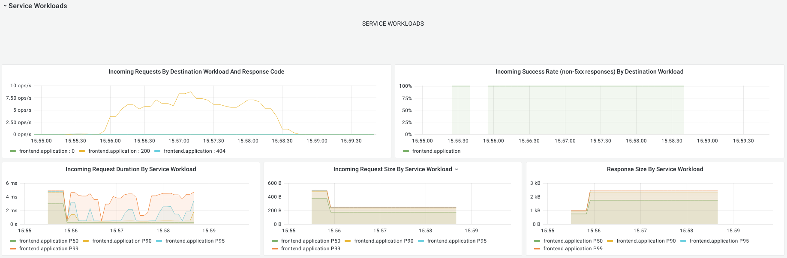

# Project README

AGISIT 20201-2022

## Authors

**Team 20A**

<p align=center>
    
    
    
</p>


| Number | Name              | Username                                     | Email                               |
| -------|-------------------|----------------------------------------------| ------------------------------------|
| ist189399 | Afonso Goncalves | <https://git.rnl.tecnico.ulisboa.pt/ist189399> | <mailto:afonso.corte-real.goncalves@tecnico.ulisboa.pt> |
| ist190621 | Maria Filipe | <https://git.rnl.tecnico.ulisboa.pt/ist190621> | <mailto:maria.j.d.c.filipe@tecnico.ulisboa.pt> |
| ist189498 | Maria Martins | <https://git.rnl.tecnico.ulisboa.pt/ist189498> | <mailto:maria.d.martins@tecnico.ulisboa.pt> |


## Solution

### Project Architecture

The figure below details the project architecture, with all the components and their relation-ships. 

<p align=center>
    
</p>

Each micro-service is replicated to assure the availability of this application. The basic interaction is as follows: The client interacts with the web-service, which is the entry point for every service in this application.
The dispatch service then balances the request load among the targeted service replicas. Each micro-service handles a task, as shown below:

 * The User service handles user tasks, such as login, registering, viewing a user shopping cart, and history
 * The Cart service manages the shopping cart of each session
 * The Ratings service handles the rating of every product in the shop
 * The Shipping service manages and allows users to track the delivery of their orders
 * All these services require application data, thus they all access a common (replicated) storage architecture, composed of three micro-services (Redis, MySQL and MongoDB)
 * This system also includes a monitoring service that regularly prompts each service to check for its health status. This way, the application managers can timely detect anomalies in the infrastructure and enhance its maintenance efficiency

Below we show some images of the deployed application

<p float="center">
  
   
</p>


We can also see some metrics shown by grafana
<p float="center">
  
   
</p>


### Project File Structure

Below we have a diagram of the directory structure.
```
.
├── providers.tf
├── gcp_gke
│   ├── gcp-gke-cluster.tf
│   ├── gcp-gke-outputs.tf
│   └── gcp-gke-variables.tf
├── gcp_k8s
│   ├── k8s-provider.tf
│   └── k8s-variables.tf
├── main.tf
└── src
    └── ...
```

 * The `providers.tf` configures the google provider, setting up the credentials for accessing the cluster
 * The `gcp_gke` directory contains the `terraform` module that declares and configures the GKE cluster.
 * The `gcp_k8s` directory contains the `terraform` module that deploys the pods and services into the GKE cluster. The `helm` provider greatly simplifies this module!
 * The `main.tf` orchestrates the invocation of the modules mentioned above, guaranteeing that the pods and services are only deployed after a cluster is created;
 * The `src` directory contains the source code for the Stan's Robot Shop;


---

## Pre-Requesites and Deployment

### Pre-Requesites

Before deploying our infrastructure, there are some steps that need to be completed:

 * Install `vagrant` in your machine
 * Create a project in your GCP account
 * Create a service account key for that project
    1. Go to the APIs & Services dashboard and enable the Kubernetes Engine API;
    2. Go to the IAM & Admin > Service Accounts page, select the default service account and then, on `Actions`, click on `Manage keys`;
    3. Click on `Add Key` > `Create new Key` and select a JSON. Then click `CREATE`. Make sure you save it on your project directory and it will not be shared in your repositories;
 * Authorize Google Cloud SDK in your `mgmt` machine to access the GCP project
    1. `ssh` into the `mgmt` machine and go to the project directory (`cd ~/labs/project`)
    2. Run `gcloud auth login`
    3. Click on the outputted link and proceed with the authentication
    4. Copy the code given after authentication and paste it in the terminal
    5. Run `gcloud config set project <project_ID>`, replacing `<project_ID>` with the actual project ID
 * Grant Kubernetes Engine Service Agent role to your service account:
    1. Go to IAM & Admin > IAM
    2. Select your service account (ending with `@developer.gserviceaccount.com`)
    3. Click `Edit` and then on `Add Another Role` and select `Kubernetes Engine Service Agent`
    4. Finally, click `Add Role`
 * Update the project variables
    1. Create a new file named `terraform.tfvars` with the following contents:
            ```
            project = ""
            credentials_file = ""
            workers_count = "7"
            region = "europe-west4-a"
            ```

        i. Set the `project` variable to your project ID
        ii. Set the `credentials_file` variable to the path to the key file your previously saved
        iii. Feel free to change the number of worker nodes in the cluster (`workers_count`) and the region (`region`) where the cluster will be deployed
 * Run `terraform init`
 * Install Istio, by running `curl -L https://istio.io/downloadIstio | ISTIO_VERSION=1.9.2 sh -`


### Deployment

 * Run `terraform apply` to deploy the infrastructure and insert `yes` if you want to apply that plan
 * Go to the GCP Project dashboard (make sure you have your project selected) and, on the left side, select `Kubernetes Engine` > `Services & Ingress`
 * Find the line that contains the `web` service and click on the IP present in the `Endpoints` column.
 * You will enter in the Stan's Robot Shop website. Good shopping! :D

If you want to check the status of your cluster via command line, after having the cluster deployed, do the following:

 * SSH into the `mgmt` machine and go to your project directory;
 * In the browser, go to the GCP console and select your project;
 * In the sidebar, go to `Kubernetes Engine > Clusters`;
 * In the `Actions` option of the target cluster, click `Connect`;
 * Copy the `gcloud` command given and run it in the `mgmt` machine.


## Final Remarks

We can conclude this project on a very positive note. It was the perfect way of gaining real insight on how to deploy micro-services based applications and what issues we may encounter during that process.
More than ten different technologies were used in order to achieve all the goals we proposed: having a frontend, a backend service, a datastore and a monitoring service as part of a functional system.
In summary, our application was deployed in a Kubernetes Clusters using GKE and the cluster with the working nodes was provided by Terraform.
In the end, a ISTIO Service Mesh was added and Prometheus and Grafana were used as the monitoring services.

With all this, we learned the value of IaC and monitoring.
IaC is invaluable in cost reduction, achieving better speed through faster executing and finally in reducing risk by removing human error from the equation.
On top of that, we learned that monitoring is useful to detect problems in the infrastructure and also to maintain efficiency. 

Finally, it's possible to state that the goal of deploying a micro-services based containerized Web Application on a Public Cloud provider using automation tools as well as implementing monitoring tools was achieved with success.

---

```
 -----------
< TEAM 20 A >
 -----------
        \   ^__^
         \  (oo)\______
            (__)\       )\/
                ||----w 
                ||     |
```
