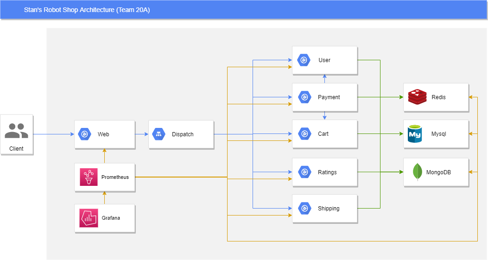

# Project - CheckPoint II README

AGISIT 20201-2022

## Authors

**Team 20A**

<p align=center>
    
    
    
</p>


| Number | Name              | Username                                     | Email                               |
| -------|-------------------|----------------------------------------------| ------------------------------------|
| ist189399 | Afonso Goncalves | <https://git.rnl.tecnico.ulisboa.pt/ist189399> | <mailto:afonso.corte-real.goncalves@tecnico.ulisboa.pt> |
| ist190621 | Maria Filipe | <https://git.rnl.tecnico.ulisboa.pt/ist190621> | <mailto:maria.j.d.c.filipe@tecnico.ulisboa.pt> |
| ist189498 | Maria Martins | <https://git.rnl.tecnico.ulisboa.pt/ist189498> | <mailto:maria.d.martins@tecnico.ulisboa.pt> |


## Module Leaders

The group unanimously decided to work together in every aspect of this project, since this way, everyone would learn something from every part of it, and at the same pace. The group worked always together, thus everyone worked the same number of hours.

## Application

The Stan's Robot Shop is a sample microservice application that can used as a sandbox to test and learn containerised application orchestration and monitoring techniques. Its a simple ecommerece storefront that includes: a product catalogue, a user repository, shopping cart and order pipeline.

## Project Architecture

The project architecture is detailed down below with all the components and their relationships. As seen in the diagram, the solution is composed of nine microservices (`user`, `payment`, `cart`, `ratings`, `shipping`, `redis`, `mysql`, `mongodb` and `web`) and a load balancer called dispatch. The client interacts directly with the web microservice.

<p align=center>
    
</p>

## Project Files

Below we have a diagram of the directory structure.

```
.
├── gcp-gke-provider.tf
├── gcp_gke
│   ├── gcp-gke-cluster.tf
│   ├── gcp-gke-outputs.tf
│   └── gcp-gke-variables.tf
├── gcp_k8s
│   ├── k8s-provider.tf
│   └── k8s-variables.tf
├── gcp-gke-main.tf
└── src
    └── ...
```

 * The `gcp-gke-provider.tf` configures the google provider, setting up the credentials for the deployments
 * The `gcp_gke` directory contains the `terraform` module that declares and configures the GKE cluster.
 * The `gcp_k8s` directory contains the `terraform` module that deploys the pods and services into the GKE cluster. The `helm` provider greatly simplifies this module!
 * The `gcp-gke-main.tf` orchestrates the invocation of the modules mentioned above, guaranteeing that the pods and services are only deployed after a cluster is created;
 * The `src` directory contains the source code for the Stan's Robot Shop;

## Pre-Requesites and Deployment

### Pre-Requesites

Before deploying our infrastructure, there are some steps that need to be completed:

 * Install `vagrant` in your machine
 * Create a project in your GCP account
 * Create a service account key for that project
    1. Go to the APIs & Services dashboard and enable the Kubernetes Engine API;
    2. Go to the IAM & Admin > Servive Accounts page, select the default service account and then, on `Actions`, click on `Manage keys`;
    3. Click on `Add Key` > `Create new Key` and select a JSON. Then click `CREATE`. Make sure you save it on your project directory and it will not be shared in your repositories;
 * Authorize Google Cloud SDK in your `mgmt` machine to access the GCP project
    1. `ssh` into the `mgmt` machine and go to the project directory (`cd ~/labs/project`)
    2. Run `gcloud auth login`
    3. Click on the outputted link and proceed with the authentication
    4. Copy the code given after authentication and paste it in the terminal
    5. Run `gcloud config set project <project_ID>`, replacing `<project_ID>` with the actual project ID
 * Update the project variables
    1. Create a new file named `terraform.tfvars` with the following contents:

            ```
            project = ""
            credentials_file = ""
            workers_count = "3"
            region = "europe-west4-a"
            ```

        a. Set the `project` variable to your project ID

        b. Set the `credentials_file` variable to the path to the key file your previously saved

        c. Feel free to change the number of worker nodes in the cluster (`workers_count`) and the region (`region`) where the cluster will be deployed
 * Run `terraform init`


### Deployment

 * Run `terraform apply` to deploy the infrastructure and insert `yes` if you want to apply that plan
 * Go to the GCP Project dashboard (make sure you have your project selected) and, on the left side, select `Kubernetes Engine` > `Services & Ingress`
 * Find the line that contains the `web` service and click on the IP present in the `Endpoints` column.
 * You will enter in the Stan's Robot Shop website. Good shopping! :D

---

```
 -----------
< TEAM 20 A >
 -----------
        \   ^__^
         \  (oo)\______
            (__)\       )\/
                ||----w 
                ||     |
```
