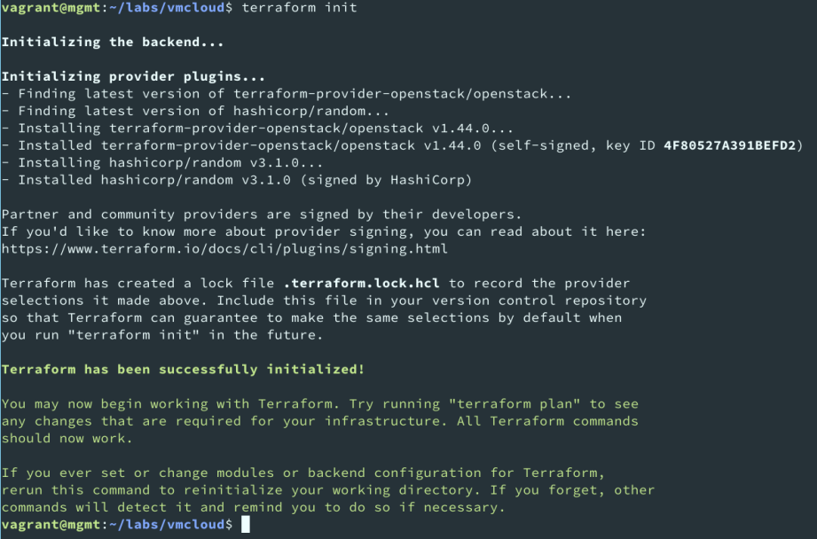
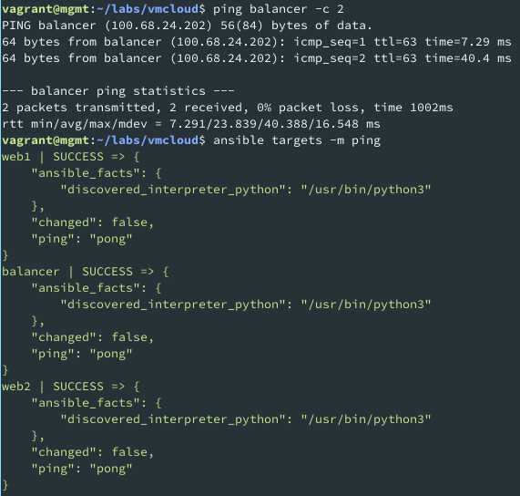
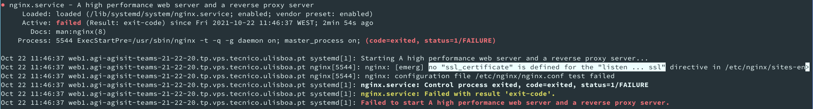
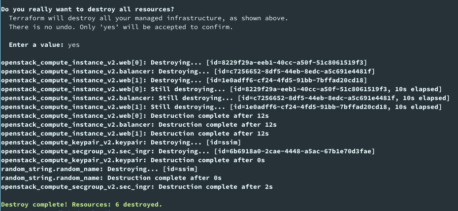
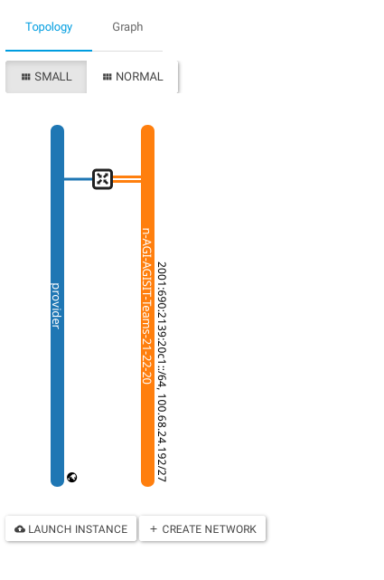

# LAB02 README

AGISIT 20201-2022

## Authors

[//]: # (fill the following line with the Group Identifier, for example 03A or 12T, and then delete THIS line)
**Team 20A**

[//]: # (use photos of team members 150px height, square; and then delete THIS line)

    
    
    

[//]: # (fill the following table with identifiers of each team member; and then delete THIS line)

| Number | Name              | Username                                     | Email                               |
| -------|-------------------|----------------------------------------------| ------------------------------------|
| ist189399 | Afonso Goncalves | <https://git.rnl.tecnico.ulisboa.pt/ist189399> | <mailto:afonso.corte-real.goncalves@tecnico.ulisboa.pt> |
| ist190621 | Maria Filipe | <https://git.rnl.tecnico.ulisboa.pt/ist190621> | <mailto:maria.j.d.c.filipe@tecnico.ulisboa.pt> |
| ist189498 | Maria Martins | <https://git.rnl.tecnico.ulisboa.pt/ist189498> | <mailto:maria.d.martins@tecnico.ulisboa.pt> |

## Q01
The plugins installed were terraform-provider-openstack/openstack and hashicorp/random as we can confirm below:

    

## Q02
In the part of the file dedicated to the keypair it creates a random name for the keypair with lenght 4, with no upper and special characters. Then it loads the public key from a file in the ssh key public variable.
In the web server part it states the information of the two servers, their names(web1 and web2), their image(Ubuntu-Focal-Latest), the flavor_name, their key pairs, security groups(default and the one created in the vmcloud networks file) and network.
Finally, in the load balancer part we have declared a different name(balancer) and a different flavor_name, however the image and the network it is in is the same as the one from the web servers.

## Q03
The file is creating a security group and its rules. It defines the name and the description and two rules for the TCP protocol were it allows connections for every IP from port 80 to port 80(HTTP) and the same for port 443(HTTPS).

## Q04
In the file terraform-vmcloud-networks.tf we would change the value in the count index(line 27).

## Q05
The new file that appeared was called .terraform.lock.hcl

## Q06
The mapping between IP and server names was changed with the ones given by the terraform apply output. The purpose was to allow access to other machines via hostname.

## Q07
The result was successful as seen below:

    

As seen before in Q02, the file terraform-vmcloud-servers.tf adds the public key that was installed in each VM when the machines were created to those same machines. This means that every VM already contains the public key of the management node in the authorized_hosts file which makes the connection successful.

## Q08
The modified files were index.html.j2, ha_proxy.cfg.j2 and index.html.j2.
In the file index.html.j2 there were some missing quotes around the ansible_facts which was resulting in an invalid access since it was accessing the IP of each server but it didn't keept the provided query structure like it should. So the solution here was to add the quotes around ansible_facts.

Then, we noticed that in the haproxy.cfg.j2 file the ansible_facts was already well quoted, however the access to ansible_default_ipv4.interface was quoted when it shouldn't be. It was then fixed to look like this: hostvars\[host]\['ansible_facts']\[ansible_default_ipv4.interface].ipv4.address.

Finally, when trying to run we saw an error that said that Ansible failed to restart the nginx service. After sshing to one of these machines and running systemctl status nginx, we got the following output:

    

We were then able to understand that it was configured to listen in port 443(SSH), but since none of the VMs had any certificate for that we opted to comment out the line were it was listening for the connection.(default-site.j2:line 6).

## Q09
Yes. The name of the server and the IP of the server that show up in the center of the page change everytime we refresh the page, just like it should since the load balancer is alternating them using the roundrobin mode.

## Q10
Looking at the results below we can conclude that there are no resources left and everything as been destroyed:

The output of terraform destroy:

    

The VMCloud Dashboard:

    

