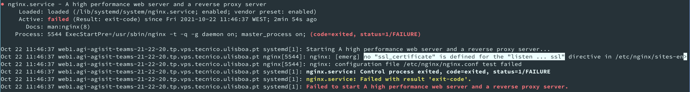
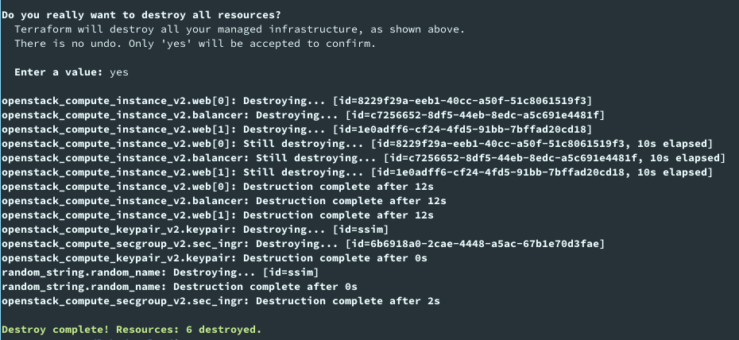
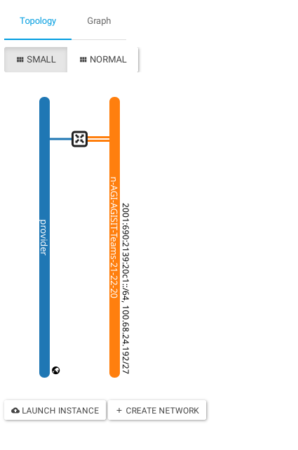

# Webfront Lab README

AGISIT 20201-2022

## Authors

[//]: # (fill the following line with the Group Identifier, for example 03A or 12T, and then delete THIS line)
**Team 20A**

[//]: # (use photos of team members 150px height, square; and then delete THIS line)
<p align=center>
    
    
    
</p>


[//]: # (fill the following table with identifiers of each team member; and then delete THIS line)

| Number | Name              | Username                                     | Email                               |
| -------|-------------------|----------------------------------------------| ------------------------------------|
| ist189399 | Afonso Goncalves | <https://git.rnl.tecnico.ulisboa.pt/ist189399> | <mailto:afonso.corte-real.goncalves@tecnico.ulisboa.pt> |
| ist190621 | Maria Filipe | <https://git.rnl.tecnico.ulisboa.pt/ist190621> | <mailto:maria.j.d.c.filipe@tecnico.ulisboa.pt> |
| ist189498 | Maria Martins | <https://git.rnl.tecnico.ulisboa.pt/ist189498> | <mailto:maria.d.martins@tecnico.ulisboa.pt> |


## Q01
 > When you run the command `terraform init` which plugins were installed? (You can copy the result of the command to insert in your report).

```
vagrant@mgmt:~/labs/vmcloud$ terraform init

Initializing provider plugins...
    ...
- Installed terraform-provider-openstack/openstack v1.44.0 (self-signed, key ID 4F80527A391BEFD2)
- Installed hashicorp/random v3.1.0 (signed by HashiCorp)
```

## Q02
 > Analyze briefly the `terraform-vmcloud-servers.tf` and interpret its purpose.

| Line no | Interpretation |
| ------- | -------------- |
| 12-17   | Resource that generates a new random string of 4 characters each time it is used |
| 19-22   | Loads public key from file in ssh\_key\_public variable (`id_rsa.pub`) |
| 26-37   | Declare 2 servers (named web1 and web2) running Ubuntu-Focal-Latest, associated with the previously generated keypair. These machines will have `t1.nano` `flavor_name` attribute. Each server belongs to the `default` security group as well as to the one created in `terraform-vmcloud-networks.tf` file. Each server is attached to the network with the name defined in `unique_network_name` variable (`n-AGI-AGISIT-Teams-21-22-20`) |
| 40-51   | Declares the Load Balancer node (named `balancer`), having the same OS, security groups and keypair as the web servers. It is attatched to the same network as the previous machines. It has a `t1.micro` flavour |


## Q03
 > Analyze briefly the `terraform-vmcloud-networks.tf` and interpret its purpose.

| Line no | Interpretation |
| ------- | -------------- |
| 6       | Sets the security group name |
| 7       | Sets the security group description |
| 9-14    | Opens port 80 for TCP connections for every IP address (line 13)  |
| 16-21   | Opens port 443 for TCP connections for every IP address (line 20) |


## Q04
 > If you would need more Web servers where and how would you declare that intention (with Terraform)?

We could change the count property in file `terraform-vmcloud-networks.tf:26`

## Q05
 > Which other files appeared in the `vmcloud` folder after running `terraform apply` for your infrastructure? .

Terraform created the `.terraform.lock.hcl` file to record the provider choices 


## Q06
 > After creating the infrastructure with Terraform, you needed to modify the `myhost` inventory. What was changed in that file, and what was the purpose?

We replaced the placeholders in the IP list with the IPs given by the `terraform apply` command output. We also commented every line related to web3 since we only used 2 web servers.


## Q07
 > After creating the infrastructure with Terraform, you have tested the communication with the remote instances using an Ansible ad-hoc command. Copy the result into your report. Was the result successful? In case of positive answer, can you explain why it worked, i.e., how was Ansible capable of establishing a session with the remote instances?

The connectivity was successful. The `ssh` connection succeeded since every VM already contained the `mgmt` public key in their `~/.ssh/authorized_hosts` file. This key was installed when the machines were created. This occured since lines `31` and `44` of `terraform-vmcloud-servers.tf` attach this same public key to these machines.


## Q08
 > Which files did you had to modify, so that Ansible could Configure correctly the instances? Explain in detail what were the modifications.

As we can see in commit `1dca56d64c`, there were 3 changes in erroneous files.

The first error reported by Ansible occured during the generation of the `index.html` file from the jinja2 template. At a first glance, everything was correct, however, there was an invalid access to the `ansible_facts` of each host. We understood that that this line was accessing the IP of each server as in the previous lab, however, we wanted to keep the provided query structure, since it might aimed to access a different value. We analyzed the host facts and incrementaly created the path to the desired fact. In lab class, our professor explained that this solution may not be the best one since there may be multiple IPs. In that case, we would use analyse the facts of that machine and use the desired index of that array. Alternatively, we could also use the direct variable as we did in the previous lab.

By looking at the final changes to the file, we noticed that the only applied change was the insertion of quotes around `ansible_facts` key. We then understood that the access to `hostvars[ansible_hostname][ansible_facts]` will have `ansible_facts` replaced by the value of that magic variable, which will be an invalid key, causing this error.

The second error was similar to the first one. Although the `ansible\_facts` key was properly quoted, the `ansible_default_ipv4.interface` key was quoted, presenting an invalid key. For the sake of consistency, we changed the following accesses to be identical to the ones in the previous file.

The final error reported that Ansible failed to restart nginx service in the web machines. After `ssh`ing to one of these machines and running `systemctl status nginx`, we got the following output:

<p align=center>
    
</p>

We understood that there was a certificate missing in each VM. We could generate one using Let's Encrypt. However, it was simpler to remove HTTPS from these servers, as it was not required in this project. To do so, we commented out the line that configured nginx to listen in port 443 (the default SSL port) in the corresponding template file.


## Q09
 > When the system was fully deployed, when hitting the refresh button on the web browser with the address of the Load Balancer, What changed? Describe those changes and interpret why they happened (if indeed happened).

At each refresh, the presented page would change according to the web server that was serving it. This happened since the balancer was alternating the servers in a roundrobin mode, as configured in the `haproxy.cfg.j2:54` template.


## Q10
 > When you run `terraform destroy` what was the result after you have confirmed the question "Do you really want to destroy all resources?". Copy those results to your report. After the destroy, looking at the VMCloud Dashboard, was there some resources left or the ones created have really been destroyed?

After running `terraform destroy` command, we could see the following output:

<p align=center>
    
</p>

Meaning that the virtual machines were successfully destroyed. When checking the VMCloud Dashboard, we could confirm that the operation was successful:


<p align=center>
    
</p>
