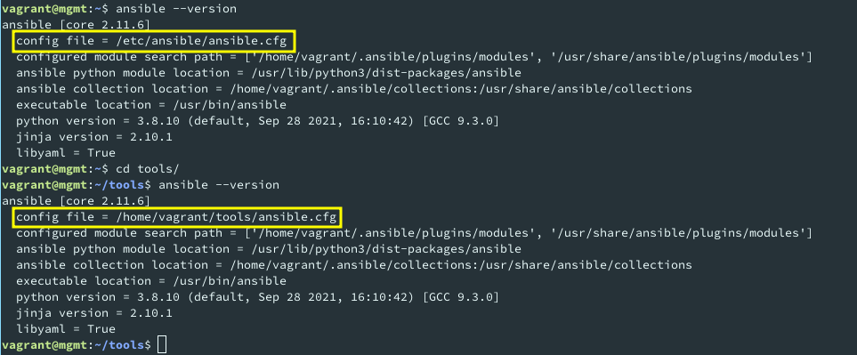

# Webfront Lab README

AGISIT 20201-2022

## Authors

[//]: # (fill the following line with the Group Identifier, for example 03A or 12T, and then delete THIS line)
**Team 20A**

[//]: # (use photos of team members 150px height, square; and then delete THIS line)

    
    
    

[//]: # (fill the following table with identifiers of each team member; and then delete THIS line)

| Number | Name              | Username                                     | Email                               |
| -------|-------------------|----------------------------------------------| ------------------------------------|
| ist189399 | Afonso Goncalves | <https://git.rnl.tecnico.ulisboa.pt/ist189399> | <mailto:afonso.corte-real.goncalves@tecnico.ulisboa.pt> |
| ist190621 | Maria Filipe | <https://git.rnl.tecnico.ulisboa.pt/ist190621> | <mailto:maria.j.d.c.filipe@tecnico.ulisboa.pt> |
| ist189498 | Maria Martins | <https://git.rnl.tecnico.ulisboa.pt/ist189498> | <mailto:maria.d.martins@tecnico.ulisboa.pt> |

## Q01
> *Interpret the Vagranfilethat will be used, explaining, in your own words, what you think the “instructions” in it are supposed to do.*

| Line no | Interpretation |
| ------- | -------------- |
| 5 | Assures that the Vagrant provider will be VirtualBox |
| 7-16 | Installs the `vagrant-vbguest` and `vagrant-reload plugins` |
| 20 | Stops Vagrant from adding an ssh keypair to the guest |
| 21 | Vagrant updates GuestAdditions at each start |
| 22 | Stops Vagrant from checking for updates on `vagrant up` |
| 25, 54, 84 | Defines a VM in a multi-VM environment |
| 26, 55, 85 | Configures the OS that will run in the specified box |
| 27, 56, 86 | Sets the hostname the machine should have |
| 28, 57, 87 | Configures the network the machine will be connected to: a private network with a fixed IP |
| 31, 61, 91 | Sets the machine name (the one that appears in the VirtualBox GUI |
| 32, 62, 92 | Lets guest machine to use the host's NAT and DNS resolver mechanisms |
| 33, 63, 93 | Sets the machine memory (MB) |
| 34, 64, 94 | Sets the number of virtual CPUs for the machine |
| 37-45, 67-75, 97-105 | Mounts the host `./tools` directory into the guest `/home/vagrant/tools` directory |
| 47-50, 77-78, 107-108 | Provisions the machines with configuration scripts. Reloads machine at the end to apply changes |
| 58 | Forwards host 8080 port to guest 80 |
| 82 | Repeats lines 83 - 109 3 times, replacing `#{i}` by the number of that iteration |

## Q02
> *Analyze briefly the `bootstrap.sh` the `host\_ip.sh` and the `host\_ssh.sh` to interpret their purpose.*

| File | Purpose |
| ------- | -------------- |
| `bootstrap.sh` | Installs the required software for the VM to run (`software-properties-common`,  `unzip`, `build-essential`, `libssl-dev`, `libffi-dev`, `gnupg`, `python3-dev`, `python3-pip`, `ansible`,) |
| `hosts_ip.sh` | Maps IPs to each VM hostname, so that one can access other machines via hostname |
| `host_ssh.sh` | Sets PasswordAuth to `yes` in sshd configuration file |

## Q03
> *In what differs calling `ansible --version` from any directory, when compared by calling it from the Project directory you will launch?*

We noticed that the config file path changed in different directories. This happened since in the `ansible.cfg` file present in the `tools` directory took precedence over the default configuration file.

    

## Q04
> *After changing the `Vagrantfile` to accommodate it for launching more web servers, which were the modifications in the files of the Project that you have done? (just tell the name of the file and the lines that were changed)*

 * `Vagrantfile:82`
 * `tools/inventory.ini:9`
 * `tools/inventory.ini:20`
 * `tools/inventory.ini:28`

## Q05
> *Write the result of the command `ansible all -m shell -a "uptime"` for your modified infrastructure.*

    

## Q06
> *Write the result of the command `ansible all -m shell -a "uname -a"` for your modified infrastructure*

    

## Q07
> *When deploying the Network Time Protocol (NTP) you have changed the Reference Time Servers, by modifying the Playbook in order to include a "variable" to be replaced in the NTP configuration file when Ansible runs that Playbook. However, there was a "bug" inadvertently written for this new procedure. Did you find the Bug? What corrections were made, for the NTP service to run?*

When running the template playbook for the first time, the servers would not be able to connect to any NTP server, producing the following output:

    

After analyzing the generated configuration file, at `/etc/ntp.conf`, we noticed the following erroneous line:

    

Since this file was automatically generated by ansible, we analyzed the playbook and the template file, noticing the following:

    

The error was caused since both the template and the variable had the `server` keyword, making it duplicate in the final configuration file. By removing that keyword from the variable value, in the `tools/ntp-template.yml` file, we were able to fix this error and have a correct output:

    

## Q08
> *You ran the `site_(docker/vbox).yml` Playbook. After running it for the second time, in case there were nor errors the would prevent all tasks to complete, can you describe: What happened? What did you find different (or not)?*

In the first run, the ansible `PLAY RECAP` showed that all servers were changed by the playbook. In subsequent runs, no servers were changed. This happened since these instructions are idempotent. Since the machines were already in the desired state, there was no need to apply new changes.

## Q09
> *When the system was deployed, when hitting the refresh button on the web browser (forcing with the Shift key): Did something change?*

Yes, the HTML page showed that it was being served from different servers and different IPs, proving that the load balancer was correctly functioning.

## Q10
> *When using the Benchmarking tool, when using the concurrency parameter (-c) to a value still sustainable, What did you observe in the results of the Benchmark, were there errors, or failed request? (just a brief interpretation)*

We ran the benchmark making 100 000 requests, with different concurrency levels (2, 3, 5, 10, 15, 25, 50 and 100). None of the benchmarks had failed requests or produced errors, but we could notice that the time per request increased with the concurrency level, as we can see in the following table:

| Concurrency level | 2     | 3     | 5     | 10     | 15     | 25     | 50     | 100    |
|-------------------|-------|-------|-------|--------|--------|--------|--------|--------|
| Time per request  | 3.152 | 4.376 | 6.743 | 11.352 | 13.332 | 21.354 | 41.815 | 86.141 |
