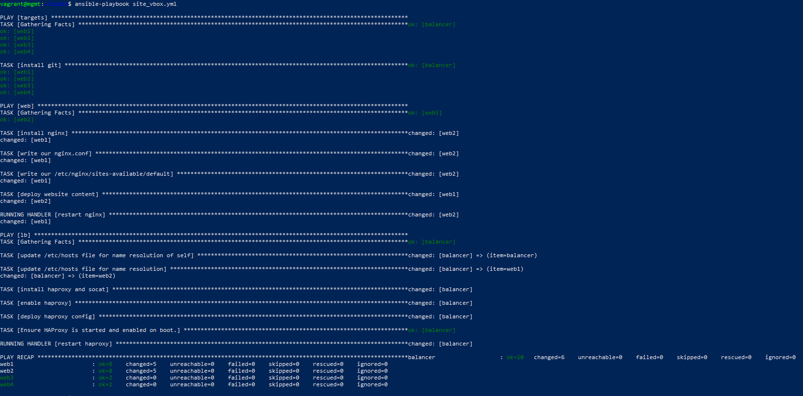
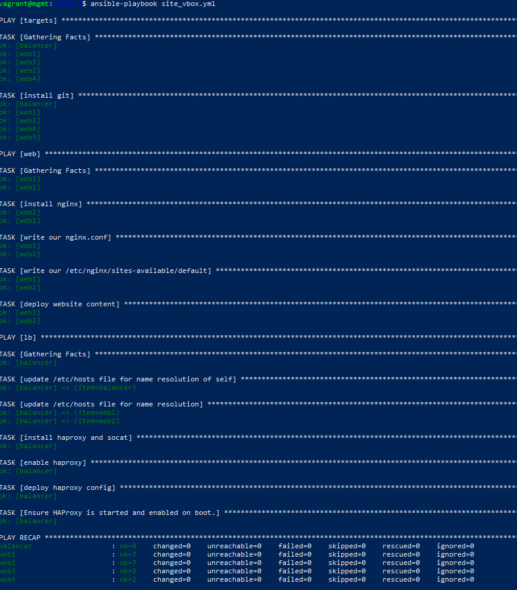

# Project README

AGISIT 20201-2022

## Authors

[//]: # (fill the following line with the Group Identifier, for example 03A or 12T, and then delete THIS line)
**Team 20A**

[//]: # (use photos of team members 150px height, square; and then delete THIS line)

    
    
    

[//]: # (fill the following table with identifiers of each team member; and then delete THIS line)

| Number | Name              | Username                                     | Email                               |
| -------|-------------------|----------------------------------------------| ------------------------------------|
| ist189399 | Afonso Goncalves | <https://git.rnl.tecnico.ulisboa.pt/ist189399> | <mailto:afonso.corte-real.goncalves@tecnico.ulisboa.pt> |
| ist190621 | Maria Filipe | <https://git.rnl.tecnico.ulisboa.pt/ist190621> | <mailto:maria.j.d.c.filipe@tecnico.ulisboa.pt> |
| ist189498 | Maria Martins | <https://git.rnl.tecnico.ulisboa.pt/ist189498> | <mailto:maria.d.martins@tecnico.ulisboa.pt> |

## Q01
Vagrantfile - is composed of the instructions for the creation of the VMs and their configuration.
In this case it has the hostname, the private ip, and for the virtualbox, the memory and cpus that it will have and use.

## Q02
Bootstraph.sh - installs all the packages and dependencies required for everything to work

Host_ip.sh - configures the host file with the ip for each virtual machine in the private network

Host_ssh.sh - sets the password authentication to yes in the sshd files

## Q03
Ansible is installed in the mgmt server. This means that running the ansible --version there will yield a result and doing it outside of that server is going to result in an error (ansible : The term 'ansible' is not recognized as the name of a cmdlet, ...) since it is not installed there.

## Q04
inventory.ini - uncommented the lines of the vms that were commented (line numbers 9,10,28 and 29)
vagrantfile - changed 1..2 to 1..4 (line number 82)

## Q05
balancer | CHANGED | rc=0 >>
 11:11:16 up 29 min,  1 user,  load average: 0.11, 0.03, 0.01
web2 | CHANGED | rc=0 >>
 11:11:14 up 27 min,  1 user,  load average: 0.01, 0.00, 0.00
web1 | CHANGED | rc=0 >>
 11:11:15 up 28 min,  1 user,  load average: 0.00, 0.00, 0.00
web3 | CHANGED | rc=0 >>
 11:11:15 up 10 min,  1 user,  load average: 0.04, 0.03, 0.02
web4 | CHANGED | rc=0 >>
 11:11:15 up 6 min,  1 user,  load average: 0.00, 0.12, 0.09
localhost | CHANGED | rc=0 >>
 11:11:16 up 28 min,  1 user,  load average: 0.08, 0.03, 0.01

## Q06
web2 | CHANGED | rc=0 >>
Linux web2 5.4.0-88-generic #99-Ubuntu SMP Thu Sep 23 17:29:00 UTC 2021 x86_64 x86_64 x86_64 GNU/Linux
web4 | CHANGED | rc=0 >>
Linux web4 5.4.0-88-generic #99-Ubuntu SMP Thu Sep 23 17:29:00 UTC 2021 x86_64 x86_64 x86_64 GNU/Linux
web3 | CHANGED | rc=0 >>
Linux web3 5.4.0-88-generic #99-Ubuntu SMP Thu Sep 23 17:29:00 UTC 2021 x86_64 x86_64 x86_64 GNU/Linux
balancer | CHANGED | rc=0 >>
Linux balancer 5.4.0-88-generic #99-Ubuntu SMP Thu Sep 23 17:29:00 UTC 2021 x86_64 x86_64 x86_64 GNU/Linux
web1 | CHANGED | rc=0 >>
Linux web1 5.4.0-88-generic #99-Ubuntu SMP Thu Sep 23 17:29:00 UTC 2021 x86_64 x86_64 x86_64 GNU/Linux
localhost | CHANGED | rc=0 >>
Linux mgmt 5.4.0-88-generic #99-Ubuntu SMP Thu Sep 23 17:29:00 UTC 2021 x86_64 x86_64 x86_64 GNU/Linux

## Q07
The bug was in the line number 7, the var for noc_ntpserver was "server 0.europe.pool.ntp.org" when it should only be "0.europe.pool.ntp.org". After that, the NTP server worked again and started returning the time.

## Q08
The first time running the playbook the output was the following:

    

From that we can conclude, by looking at the output and the recap that every single served had changes applied to it.
However, as mentioned in Part 3 of the guide, there is idempotence, so if nothing changed the script runs without changes applied to the servers. That is exactly what happens when we run the second time, as confirmed below by the output:

    

## Q09
Yes. The name of the server and the IP of the server that show up in the center of the page change everytime we refresh the page, just like it should since we are making use of a load balancer (the fact that it is working can also be verified by looking at the statistics page).

## Q10
While testing with 1000 request there were no failures nor errors. The tests were done with different concurrency values (2,4,8,16,32, 64 and 128). From those tests it was possible to conclude that the time per request increases with increased concurrency.
