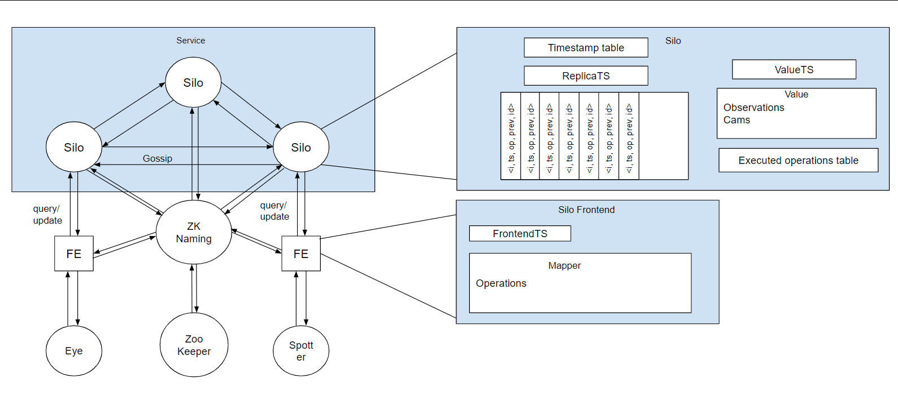

# Relatório do projeto Sauron

Sistemas Distribuídos 2019-2020, segundo semestre

## Autores

**Grupo A04**

 

| Número | Nome              | User                             | Email                                                     |
| -------|-------------------|----------------------------------| ----------------------------------------------------------|
| 89399  | Afonso Gonçalves  | <https://github.com/afonsocrg>   | <mailto:afonso.corte-real.goncalves@tecnico.ulisboa.pt>   |
| 89427  | Daniel Seara      | <https://github.com/Beu-Wolf>    | <mailto:daniel.g.seara@tecnico.ulisboa.pt>                |
| 89496  | Marcelo Santos    | <https://github.com/tosmarcel>   | <mailto:marcelocmsantos@tecnico.ulisboa.pt>               |

 
  

## Melhorias da primeira parte

 * [Remover synchronized das funções](https://github.com/tecnico-distsys/A04-Sauron/commit/a7f573348f1d560f1c656fc5e5258a5a4123c529#diff-b94f1f24a093eef8b0edea4f48dae955), por criar *bottlenecks*
 
* Melhoria do conjunto de testes
    * [Added load test to report](https://github.com/tecnico-distsys/A04-Sauron/commit/70a1cda17eb81cea50e55d32ae13052a0b54d1af)
    * [Added verification of coordinates](https://github.com/tecnico-distsys/A04-Sauron/commit/a7f573348f1d560f1c656fc5e5258a5a4123c529)

 * A resposta ao `CamInfo` passa a retornar [apenas as coordenadas da câmara](https://github.com/tecnico-distsys/A04-Sauron/commit/c7bc13b00d9e540ea367eb94c47af874e8a7642b)

 * Os objetos de representação de informação usados no cliente (`...DTO`) foram renomeados para objetos do domínio (`Frontend...`). Os objetos do domínio do cliente e servidor não foram unificados para manter a abstração e o isolamento dos dois.
    * [Rename DTO](https://github.com/tecnico-distsys/A04-Sauron/commit/1146664b562161ba149b6084e0632dc6340382a5)
    * [DTO package to domain](https://github.com/tecnico-distsys/A04-Sauron/commit/e77937cbea6a4430804c80e63f7396d58b455a6f)

 * Os requests de gRPC que eram feitos usando streams e metadados foram alterados para usar campos `repeated`. Todos os argumentos passaram a ser explicitamente passados dentro do corpo da mensagem.
    * *As alterações foram desenvolvidas incrementalmente ao longo de vários commits, no branch `grpcRefactor`.*
    * [Histórico de commits](https://github.com/tecnico-distsys/A04-Sauron/commits/grpcRefactor)
    * [Primeiro commit da melhoria](https://github.com/tecnico-distsys/A04-Sauron/commit/6776f84bb2e991349f311d1f313ab7afc59ec12a)
    * [Último commit da melhoria](https://github.com/tecnico-distsys/A04-Sauron/commit/4101f632e92975d5170ee29e798c154b73eb18da)

 * A mensagem usada para fazer pedidos de `Track`, `Trace` e `TrackMatch` foi [dividida em diferentes mensagens](https://github.com/tecnico-distsys/A04-Sauron/commit/9fb98d61550271844a01b61e8fb640826241dbcb), uma para cada request.

## Modelo de faltas
O modelo desenvolvido tolera diversos tipos de faltas:
 * Partições (temporárias ou permanentes) da rede: O serviço continua a funcionar, mesmo não havendo uma atualização de todas as réplicas;
 * Falha silenciosa (temporária ou permanente) de réplica sem updates por divulgar: Essa informação já existe noutras réplicas, logo é recuperada quando for retransmitida para a réplica que falhou.
 * Duplicação, omissão e reordenação de mensagens: A reenvio e identificação das mensagens resolve esta falta
 * Crash de uma réplica durante trocas de mensagens: Igual ao anterior
 * Alteração do endereço/porto de uma réplica: As ligações são estabelecidas dinamicamente usando o Zookeeper
 
Contudo, esta solução não tolera:
 * Falha do Zookeeper: Não se consegue ligar a outras réplicas
 * Crash de todas as réplicas com informação não totalmente divulgada: A informação é perdida.
 * Criação de mais réplicas do que as inicialmente acordadas: Nova réplica não é considerada nas outras
 * Réplicas instanciadas de forma não incremental (números não sequenciais): Igual ao anterior
 * Esgotamento de memória nas réplicas: Perda de novas atualizações

Para além destes casos mais simples, ainda há faltas mais complexas que não são toleradas:
 * No caso em que duas novas câmaras duplicadas se registam em réplicas diferentes antes de estas divulgarem o registo, passam a haver câmaras duplicadas no sistema. Esta falta não é contornada por não serem implementados updates imediatos em atualizações desta natureza.

## Solução

Face ao problema de replicar o servidor e tendo em conta o Teorema CAP, decidiu-se apostar numa forte disponibilidade e tolerância a partições na rede, sacrificando a coerência forte. Para garantir a maior coerência possível, as réplicas vão-se atualizando regularmente, trocando (em *background*) mensagens entre si, indicando o seu estado de atualização. Deste modo, o cliente pode contactar apenas uma réplica para o seu pedido ser atendido e receber uma resposta "atualizada".

Esta solução cobre o caso em que as réplicas falham silenciosamente: Quando uma dessas réplicas voltar ao seu comportamento normal, esta será atualizadas pelas outras. É possível que um cliente receba um estado mais antigo do que um já recebido enquanto essa réplica estiver numa fase de recuperação. Para resolver esse problema, implementou-se uma cache no cliente que guarda as respostas a cada pedido. No caso em que o cliente receba uma resposta mais antiga do que uma que já tenha recebido, este fica com a mais atual.

Deste modo, para tolerar *f* faltas serão necessárias *f+1* réplicas

## Protocolo de replicação
O protocolo implementado foi baseado no *Gossip Architecture*, descrito no livro da cadeira.

Cada réplica tem o seu estado interno (`value`), cuja versão é representada por um timestamp vetorial (`valueTS`). Esta versão resulta da execução cumulativa de um conjunto de atualizações. Existe ainda um `updateLog`, que contém o conjunto de todas as atualizações recebidas pela réplica.

Cada entrada do `updateLog` contém:
 * Update a ser executado
 * Timestamp único do update
 * Timestamp do cliente que antecedeu o update (`prevTS`)
 * Identificador único do update (`opId`)
 * Identificador da réplica que o registou

Os updates apenas são executados quando o `valueTS` da réplica for maior ou igual do que o `prevTS` do *update*, para se garantir que a réplica tem um estado mais ou igualmente atualizado do que o estado que originou o update, garantindo a dependência causal.

As réplicas atualizam-se regularmente (intervalos de 30 segundos por norma, configuráveis), trocando mensagens de update (`gossipMessage`), contendo as entradas existentes no `updateLog` da réplica que as enviou. A réplica que as recebe adiciona-as ao seu `updateLog`, para mais tarde serem executadas.

Para evitar duplicação de instruções, as réplicas adicionam um update ao seu `upateLog` se e só se o `opId` deste ainda não se encontrar registado.

Um eventual congestionamento da rede pode ser atenuado se as réplicas forem monitorizando o `valueTS` das outras e enviarem apenas os updates que a réplica de destino garantidamente ainda não tenha aplicado. Para tal, os `valueTS` são também enviados nas `gossipMessages` e guardados na `timestampTable` da réplica destino.

A cada `gossipMessage` recebida, há a possiblidade que esta contenha updates estáveis para a atualização do estado da réplica. Esta verifica, portanto, que updates do seu `updateLog` podem ser executados. Ao receber um *update* de um cliente, este é adicionado ao `updateLog` e imediatamente executado se o seu `prevTS` for menor ou igual ao `valueTS` da réplica.

## Opções de implementação

**Ordem de leituras**

A execução de queries que devolvam consigo timestamps anteriores ao registado no Frontend acionam um busca na cache. Porém, no caso em que não existam entradas na cache, aceita-se o resultado devolvido pela réplica, embora este seja antigo. Esta decisão não viola a ordem de leituras, pois se a cache não continha uma entrada para o pedido, então o cliente não teria lido um valor mais recente que o recebido. Queries posteriores à criação da entrada da cache serão então sujeitos a comparação de timestamps.
Contudo, isto é válido para a presunção de que as leituras são independentes entre si.

Notamos a exceção do query `trackMatch`:

* Efetuando um procura pelo padrão "A*", consideremos os seguintes valores dos ids devolvidos: ["AAA", "AAB", "AAC"]
* Estes resultados são colocados na cache para a entrada "A*"
* Efetuando agora uma outra procura pelo padrão "AA*", recebendo um timestamp mais antigo que o do query anterior, e com resultado ["AAA", "AAB"]. 

Dado que não existe uma entrada na cache para "AA*", o resultado ["AAA", "AAB"] é devolvido ao cliente, apesar de "AAC" se encontrar no padrão e já ter sido lido anteriormente.
Isto deve-se ao facto de considerarmos os queries `trackMatch` como independentes.

**Geração do `opID`**

Cada instância de Frontend possui um `UUID` de 128 bits e regista o número de updates enviados a réplicas em `opCount`. O `opId` resulta da concatenação de `UUID` e `opCount`. Embora não sejam garantidamente únicos, as chances de colisão são extremamente baixas. Esta abordagem foi optada por ser a mais simples de implementar.

**Campos repeated no gRPC**

Por uma questão de simplicidade, aconselhada no feedback da primeira entrega, as entradas do `updateLog` foram enviadas num campo `repeated` da mensagem de gossip definida no gRPC. Contudo, apenas é possível enviar 4MB por mensagem, havendo a possibilidade que num perído de pico de atividade, as réplicas não consigam enviar todos os updates que tenham para enviar. Será necessário estimar uma frequência de atualização adequada para que isto não aconteça. Outra possível solução será enviar as `gossipMessages` antes do intervalo definido no caso em que o número de updates exceder um *threshold* pré-definido. Assumimos que esta situação não acontece.

**A que réplicas enviar as `gossipMessages`**

Considerando a dimensão do projeto, decidiu-se que as réplicas enviassem as `gossipMessages` a todas as outras réplicas alcançáveis, tornando a difusão de updates muito rápida. Contudo, esta abordagem não é escalável com o número de réplicas, causando grandes *overheads* e congestionando a rede. Para situações com muitas réplicas pensámos em enviar as tais mensagens para um subconjunto aleatório de réplicas disponíveis. Ao escolher as réplicas aleatoriamente aumenta-se a dispersão dos updates.

**Envio de valueTS em vez de replicaTS**

Como especificado no livro, `replicaTS` é recebido para as réplicas poderem saber o estado do `updateLog` do sender e consequentemente que updates enviar. De modo a permitir o crash de réplicas, seguido de uma total recuperação do estado, envia-se `valueTS`.

## Notas finais

 * Tendo em conta que não existe um relógio universal neste sistema, os timestamps registados por cada réplica aquando de um report dependem do seu relógio local. Isto pode levar a anomalias em que reports `r1` e `r2`, registados por essa ordem, possuam timestamps tais que `r2.timestamp` < `r1.timestamp`.
 * Usaram-se Objetos para representar a informação dos updates dos clientes, pois estes não são imediatamente executados. Deste modo torna-se mais simples enviar a informação. Tomou-se partido do polimorfismo para simplificar a execução destes comandos.
